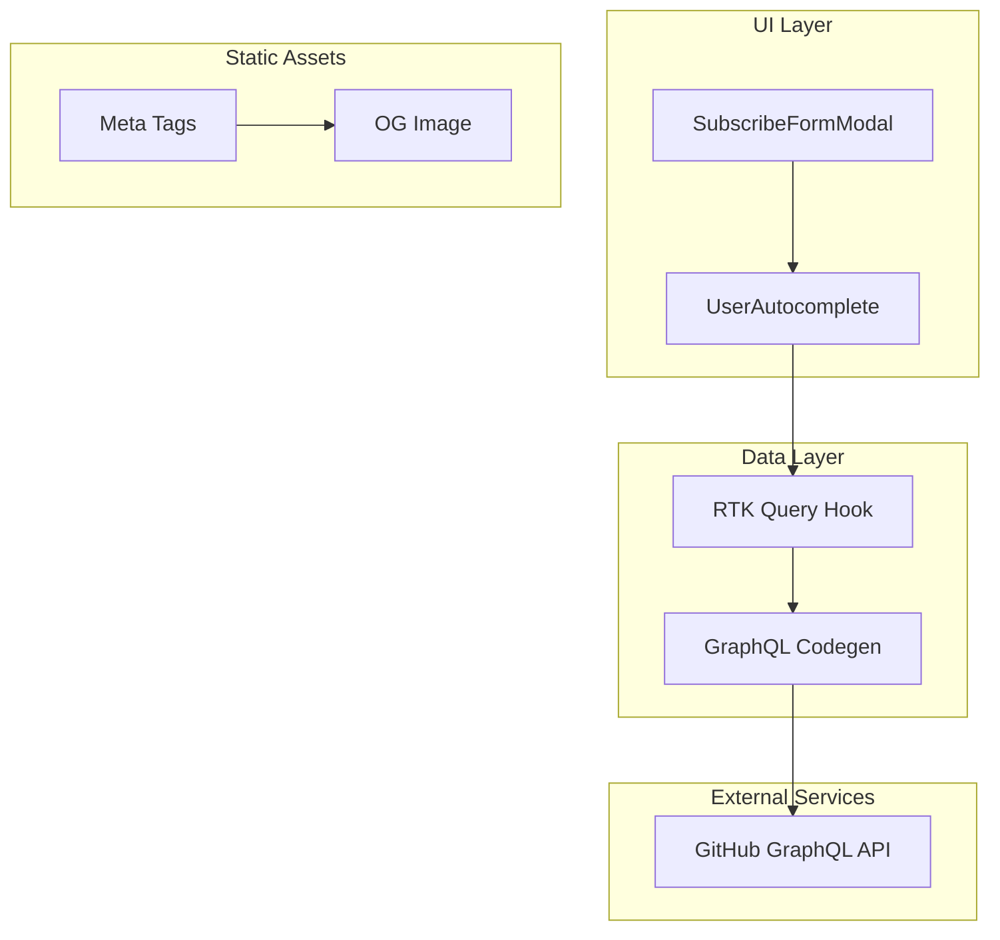
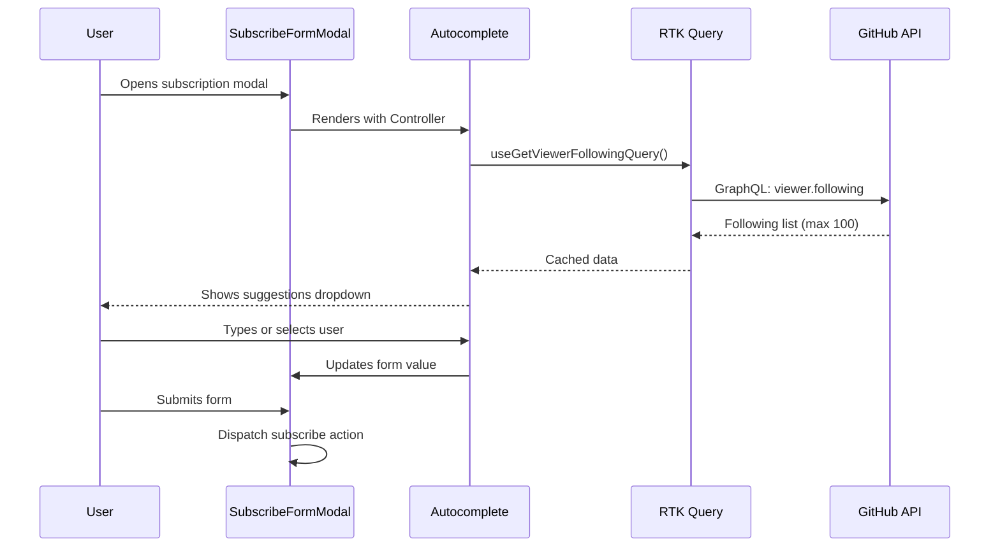

# Technical Design Document

## Overview

**Purpose**: This feature enhances the subscription experience by showing GitHub following suggestions in the username input, and improves social media discoverability through Open Graph metadata and assets.

**Users**: Authenticated users subscribing to GitHub timelines will utilize the autocomplete for faster username entry. All visitors benefit from improved social sharing previews when the app is shared on social media platforms.

**Impact**: Modifies the existing `SubscribeFormModal` component to use Autocomplete instead of TextField, adds OG meta tags to `index.html`, and creates a static OG image asset.

### Goals

- Replace manual username input with autocomplete suggestions from user's following list
- Enable both suggested and custom username entry (freeSolo mode)
- Add Open Graph metadata for rich social media link previews
- Create branded OG image asset (1200x630px)

### Non-Goals

- Pagination UI for following lists exceeding 100 users
- Dynamic OG image generation per page/user
- User search functionality beyond following list
- Landing page content restructuring or A/B testing

## Architecture

### Existing Architecture Analysis

The application follows a client-side SPA architecture with:

- **Data Layer**: RTK Query with GraphQL codegen for type-safe API calls
- **State Management**: Redux Toolkit with redux-persist for token storage
- **UI Layer**: MUI v7 with sx prop styling, Framer Motion for animations
- **Form Handling**: react-hook-form with Controller pattern

The subscription flow currently uses `SubscribeFormModal` which dispatches to `subscribedSlice` after form submission. The authentication state is managed in `authenticatorSlice` with persisted OAuth tokens.

### Architecture Pattern & Boundary Map



**Architecture Integration**:

- Selected pattern: Existing RTK Query + GraphQL codegen pattern
- Domain boundaries: UI components consume generated hooks, no direct API calls
- Existing patterns preserved: Controller pattern for forms, sx prop styling
- New components rationale: UserAutocomplete encapsulates suggestion logic
- Steering compliance: Follows tech.md patterns (RTK Query, MUI v7, TypeScript strict)

### Technology Stack

| Layer           | Choice / Version                      | Role in Feature             | Notes                                  |
| --------------- | ------------------------------------- | --------------------------- | -------------------------------------- |
| Frontend        | MUI v7.3.7 Autocomplete               | User suggestion dropdown    | freeSolo mode for custom input         |
| Data            | RTK Query + graphql-request           | Following list fetching     | Caches results automatically           |
| Code Generation | @graphql-codegen/typescript-rtk-query | Type-safe hooks             | Generates `useGetViewerFollowingQuery` |
| Assets          | Static PNG (1200x630px)               | OG image for social sharing | Manual creation required               |

## System Flows

### Following Suggestions Flow



**Key Decisions**:

- Data fetched on component mount, not on input focus (simpler, pre-loaded)
- Local filtering applied as user types (instant response, no API calls)
- freeSolo allows bypass of suggestions for users not followed

## Requirements Traceability

| Requirement | Summary                     | Components                           | Interfaces                    | Flows                      |
| ----------- | --------------------------- | ------------------------------------ | ----------------------------- | -------------------------- |
| 1.1         | User Following Autocomplete | UserAutocomplete, SubscribeFormModal | FollowingUser type            | Following Suggestions Flow |
| 1.2         | GraphQL Query for Following | getViewerFollowing.graphql           | GetViewerFollowingQuery       | Data fetching              |
| 1.3         | Autocomplete UI Component   | UserAutocomplete                     | AutocompleteProps integration | Rendering                  |
| 2.1         | Open Graph Metadata         | index.html                           | Meta tags                     | Static                     |
| 2.2         | OG Image Asset              | og-image.png                         | N/A                           | Static                     |
| 2.3         | Landing Page Content        | Existing components                  | N/A                           | Content update             |

## Components and Interfaces

| Component                  | Domain/Layer | Intent                      | Req Coverage | Key Dependencies                            | Contracts       |
| -------------------------- | ------------ | --------------------------- | ------------ | ------------------------------------------- | --------------- |
| getViewerFollowing.graphql | Data         | Fetch user's following list | 1.2          | GitHub GraphQL API (P0)                     | GraphQL Query   |
| UserAutocomplete           | UI           | Render suggestion dropdown  | 1.1, 1.3     | MUI Autocomplete (P0), RTK Query (P0)       | Props Interface |
| SubscribeFormModal         | UI           | Form container (modified)   | 1.1          | react-hook-form (P0), UserAutocomplete (P0) | Existing        |
| index.html                 | Static       | HTML entry point (modified) | 2.1          | og-image.png (P1)                           | Meta Tags       |
| og-image.png               | Asset        | Social sharing image        | 2.2          | N/A                                         | File Spec       |

### Data Layer

#### getViewerFollowing.graphql

| Field        | Detail                                                |
| ------------ | ----------------------------------------------------- |
| Intent       | Fetch authenticated user's following list from GitHub |
| Requirements | 1.2                                                   |

**Responsibilities & Constraints**

- Query the viewer's following connection with first 100 users
- Return login, name, and avatarUrl for each followed user
- Respect GitHub API rate limits (5000/hour for authenticated)

**Dependencies**

- External: GitHub GraphQL API — data source (P0)

**Contracts**: GraphQL Query

##### GraphQL Query Contract

```graphql
query getViewerFollowing($first: Int = 100) {
  viewer {
    following(first: $first) {
      totalCount
      nodes {
        login
        name
        avatarUrl
      }
    }
  }
}
```

- Pagination: `first` argument limits results (default 100)
- Response type: `FollowingConnection` with `UserConnection` nodes
- Authentication: Requires valid OAuth token in Authorization header

**Implementation Notes**

- Integration: Place in `src/gql/getViewerFollowing.graphql`, run `pnpm codegen`
- Validation: Token validity handled by existing RTK Query baseQuery
- Risks: Rate limiting if user refreshes excessively (mitigated by RTK Query cache)

### UI Layer

#### UserAutocomplete

| Field        | Detail                                                  |
| ------------ | ------------------------------------------------------- |
| Intent       | Render autocomplete dropdown with following suggestions |
| Requirements | 1.1, 1.3                                                |

**Responsibilities & Constraints**

- Display following users as suggestions with avatar, name, @login format
- Allow custom input via freeSolo mode
- Filter locally by name OR login as user types
- Integrate with react-hook-form Controller

**Dependencies**

- Inbound: SubscribeFormModal — renders component (P0)
- Outbound: useGetViewerFollowingQuery — data source (P0)
- External: @mui/material Autocomplete — UI component (P0)

**Contracts**: Props Interface

##### Props Interface

```typescript
interface FollowingUser {
  login: string
  name: string | null
  avatarUrl: string
}

interface UserAutocompleteProps {
  value: string
  onChange: (value: string) => void
  error?: boolean
  helperText?: string
}
```

- `value`: Current selected/typed username
- `onChange`: Callback when selection changes
- `error`/`helperText`: Form validation feedback
- Preconditions: User must be authenticated (token available)
- Postconditions: Returns selected user's login OR custom string

##### State Management

- State model: Local loading state from RTK Query hook
- Persistence: Following list cached by RTK Query (default cache time)
- Concurrency: Single request on mount, no race conditions

**Implementation Notes**

- Integration: Use MUI Autocomplete with `freeSolo={true}`, `renderOption` for custom layout
- Validation: Required field, handled by parent form via react-hook-form
- Risks: Empty following list shows only freeSolo input (acceptable per requirements)

#### SubscribeFormModal (Modified)

| Field        | Detail                                            |
| ------------ | ------------------------------------------------- |
| Intent       | Container for subscription form with autocomplete |
| Requirements | 1.1                                               |

**Responsibilities & Constraints**

- Replace TextField with UserAutocomplete component
- Maintain existing form submission logic
- Preserve radio button selection for information type

**Dependencies**

- Outbound: UserAutocomplete — renders child (P0)
- Outbound: subscribedSlice — dispatch subscribe action (P0)
- External: react-hook-form — form management (P0)

**Contracts**: Existing interface unchanged

**Implementation Notes**

- Integration: Swap TextField for UserAutocomplete within Controller, pass field props
- Validation: Keep `rules={{ required: true }}` on Controller
- Risks: None - straightforward component replacement

### Static Assets

#### index.html (Modified)

| Field        | Detail                                      |
| ------------ | ------------------------------------------- |
| Intent       | Add Open Graph meta tags for social sharing |
| Requirements | 2.1                                         |

**Responsibilities & Constraints**

- Add OG meta tags in `<head>` section
- Reference og-image.png from /public directory
- Include Twitter Card meta tags

**Implementation Notes**

- Integration: Add meta tags after existing `<meta>` tags
- Validation: Test with Facebook Sharing Debugger, Twitter Card Validator

##### Meta Tags Specification

```html
<!-- Open Graph -->
<meta
  property="og:title"
  content="Geek Infiltration | GitHub Activity Visualization"
/>
<meta
  property="og:description"
  content="Visualize GitHub activity in a clean, elegant timeline. Track issues, PRs, and discussions from developers you follow."
/>
<meta
  property="og:image"
  content="https://geek-infiltration.vercel.app/og-image.png"
/>
<meta property="og:url" content="https://geek-infiltration.vercel.app" />
<meta property="og:type" content="website" />

<!-- Twitter Card -->
<meta name="twitter:card" content="summary_large_image" />
<meta
  name="twitter:title"
  content="Geek Infiltration | GitHub Activity Visualization"
/>
<meta
  name="twitter:description"
  content="Visualize GitHub activity in a clean, elegant timeline."
/>
<meta
  name="twitter:image"
  content="https://geek-infiltration.vercel.app/og-image.png"
/>
```

#### og-image.png

| Field        | Detail                                      |
| ------------ | ------------------------------------------- |
| Intent       | Visual asset for social media link previews |
| Requirements | 2.2                                         |

**Specifications**

- Dimensions: 1200x630px (1.91:1 aspect ratio)
- Format: PNG
- Location: `/public/og-image.png`
- Safe zone: Center 80% for key content
- Content suggestions: App logo, tagline, visual hint of GitHub activity

**Implementation Notes**

- Integration: Create using design tool (Figma, Canva)
- Validation: Test across Facebook, Twitter, LinkedIn preview tools

## Data Models

### Domain Model

#### FollowingUser Entity

```typescript
/**
 * Represents a GitHub user from the viewer's following list
 */
interface FollowingUser {
  /** GitHub username (unique identifier) */
  login: string
  /** Display name (may be null if not set) */
  name: string | null
  /** Avatar image URL */
  avatarUrl: string
}
```

- Business rules: login is unique, always present; name may be null
- Invariants: avatarUrl is valid GitHub CDN URL

#### GetViewerFollowingResponse

```typescript
/**
 * GraphQL response type (auto-generated by codegen)
 */
interface GetViewerFollowingQuery {
  viewer: {
    following: {
      totalCount: number
      nodes: Array<{
        login: string
        name: string | null
        avatarUrl: string
      }>
    }
  }
}
```

## Error Handling

### Error Strategy

Graceful degradation with fallback to manual input when suggestions unavailable.

### Error Categories and Responses

**Network Errors** (API unreachable):

- Show empty dropdown, freeSolo mode allows manual input
- No error toast (silent degradation)

**Authentication Errors** (401/403):

- Redirect to login via existing auth flow
- Token refresh handled by authenticatorSlice

**Rate Limiting** (429):

- Return cached data if available
- Show loading state until cache expires

**Empty Following List**:

- Show placeholder text: "No suggestions available"
- freeSolo mode still allows manual entry

### Monitoring

- RTK Query automatically logs fetch errors to console
- Sentry integration captures unhandled exceptions

## Testing Strategy

### Unit Tests

- `UserAutocomplete` renders with loading state
- `UserAutocomplete` filters options by name and login
- `UserAutocomplete` calls onChange with selected login
- Custom input accepted in freeSolo mode
- Empty following list shows placeholder

### Integration Tests

- `SubscribeFormModal` submits with autocomplete selection
- `SubscribeFormModal` submits with custom freeSolo input
- Form validation prevents empty submission

### E2E Tests (Playwright)

- User opens modal, sees suggestions from following list
- User selects suggestion, form submits successfully
- User enters custom username, form submits successfully
- OG meta tags present in page source
- OG image loads at correct URL

## Security Considerations

- **OAuth Token Handling**: Existing secure pattern via redux-persist
- **Input Sanitization**: MUI Autocomplete handles XSS prevention
- **No Sensitive Data in OG**: Only public app info in meta tags

## Performance & Scalability

- **Target Metrics**:
  - Following list fetch: < 500ms (single GraphQL request)
  - Autocomplete filter: < 16ms (60fps local filtering)
- **Caching**: RTK Query default cache (60s) reduces API calls
- **Optimization**: Avatar images lazy-loaded via GitHub CDN

---

## Supporting References

### Autocomplete filterOptions Configuration

```typescript
import { createFilterOptions } from '@mui/material/Autocomplete'

const filterOptions = createFilterOptions<FollowingUser>({
  matchFrom: 'any',
  stringify: (option) => `${option.name ?? ''} ${option.login}`,
})
```

### Autocomplete renderOption Pattern

```typescript
renderOption={(props, option) => (
  <Box component="li" {...props} sx={{ display: 'flex', alignItems: 'center', gap: 1.5 }}>
    <Avatar src={option.avatarUrl} sx={{ width: 32, height: 32 }} />
    <Box>
      <Typography variant="body2">{option.name ?? option.login}</Typography>
      <Typography variant="caption" color="text.secondary">@{option.login}</Typography>
    </Box>
  </Box>
)}
```
