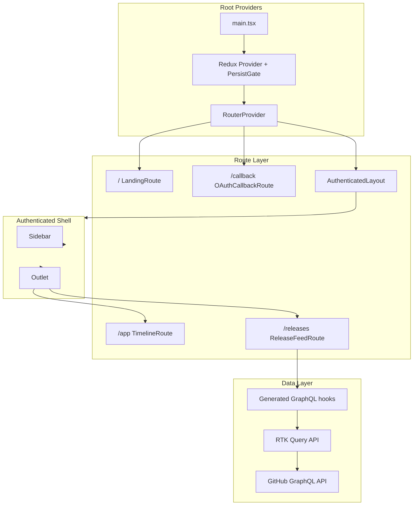
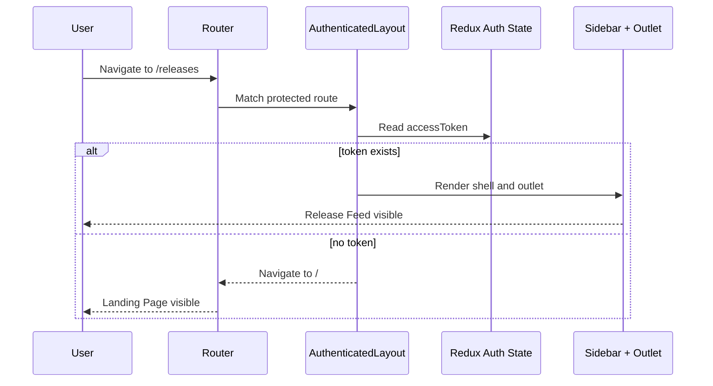
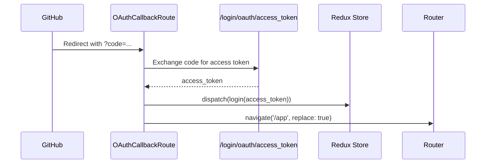
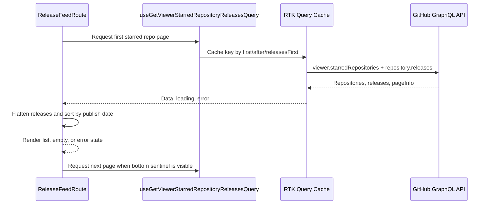

# Technical Design Document

## Overview

**Purpose**: Add a Release Feed that shows recent GitHub releases from the authenticated user's starred repositories, and introduce URL-based navigation so Geek Infiltration can support more than one authenticated view.

**Users**: Authenticated users who follow active open-source projects through starred repositories and want a chronological view of release activity without visiting each repository.

**Impact**: Replaces the current auth-only render switch with React Router v7 routes, preserves the existing Sidebar plus content shell for authenticated views, adds a generated GraphQL query for starred repository releases, and creates a Release Feed view under `/releases`.

### Goals

- Use React Router v7 for `/`, `/callback`, `/app`, and `/releases`.
- Keep the existing timelines view available at `/app`.
- Show releases from starred repositories in newest-first order.
- Support loading, empty, error, retry, and pagination states.
- Render release detail previews with repository context, badges, dates, and Markdown.
- Add E2E coverage for routing, navigation, data loading, and feed states.

### Non-Goals

- Replacing RTK Query or Redux Persist.
- Server-side rendering or React Router framework mode.
- Editing GitHub releases from the app.
- Persisting release feed data in Redux Persist.
- Implementing search/filtering beyond chronological starred-repository releases.

## Architecture

### Existing Architecture Analysis

The application is currently a React SPA with:

- **Auth gate**: `src/authenticator/index.tsx` checks `authenticator.accessToken` and renders either `src/app` or `src/LandingPage`.
- **Shell**: `src/app/index.tsx` renders a full-height MUI `Container` with `Sidebar` and `TimelineContainer`.
- **Data layer**: `src/constants/api.ts` defines RTK Query using `graphql-request` and the persisted OAuth token from Redux.
- **GraphQL codegen**: `src/gql/*.graphql` files generate hooks into `src/generated/graphql.ts`.
- **Tests**: Playwright fixtures mock GitHub GraphQL operations and seed Redux Persist auth state.

The Release Feed should preserve these boundaries. Routing should move view selection out of `Authenticator`, while auth state still comes from Redux Persist after `PersistGate` rehydration.

### Architecture Pattern & Boundary Map



**Architecture Integration**:

- Selected pattern: React Router v7 data router in library mode with route objects.
- Auth boundary: Protected route component reads Redux auth state after persistence and redirects unauthenticated users to `/`.
- Shell boundary: Sidebar lives in the authenticated layout and does not remount when moving between `/app` and `/releases`.
- Data boundary: Release data is fetched through generated RTK Query hooks only; UI components do not call `fetch` directly.
- State boundary: Release feed pagination state remains in route-local component state plus RTK Query cache, not Redux Persist.

### Technology Stack

| Layer           | Choice / Version                        | Role in Feature                                                        | Notes                                      |
| --------------- | --------------------------------------- | ---------------------------------------------------------------------- | ------------------------------------------ |
| Routing         | `react-router` v7                       | URL routes, `RouterProvider`, `Navigate`, `Outlet`, route lazy loading | New dependency required before route work  |
| UI              | MUI from `package.json`                 | Layout, cards, buttons, skeletons, badges                              | Match existing theme and `sx` patterns     |
| Data            | RTK Query + `graphql-request`           | Authenticated GitHub GraphQL requests                                  | Reuse `src/constants/api.ts`               |
| Code Generation | GraphQL Code Generator                  | Generate typed release query hooks                                     | Run `pnpm codegen` after query addition    |
| Markdown        | `react-markdown` or approved equivalent | Render release body preview safely                                     | Add only with implementation task approval |
| Testing         | Playwright                              | E2E routing and release feed state coverage                            | Reuse existing fixtures and GraphQL mocker |

## System Flows

### Authenticated Routing Flow



### OAuth Callback Flow



### Release Feed Data Flow



## Requirements Traceability

| Requirement | Summary                          | Components                                                   | Interfaces                     | Flows                                 |
| ----------- | -------------------------------- | ------------------------------------------------------------ | ------------------------------ | ------------------------------------- |
| 1           | React Router v7 Integration      | Router, AuthenticatedLayout, OAuthCallbackRoute              | RouteObject config             | Authenticated Routing, OAuth Callback |
| 2           | Navigation and Access            | Sidebar, AppShell                                            | Nav items, active route state  | Authenticated Routing                 |
| 3           | Release Feed Timeline View       | ReleaseFeedRoute, ReleaseFeedList, ReleaseCard               | ReleaseFeedItem                | Release Feed Data                     |
| 4           | Data Fetching and Pagination     | `getViewerStarredRepositoryReleases.graphql`, generated hook | GraphQL query variables/result | Release Feed Data                     |
| 5           | Release Entry Details            | ReleaseCard, ReleaseMarkdownPreview                          | Release detail props           | Release Feed Data                     |
| 6           | Error Handling and Edge Cases    | ReleaseFeedState, Retry action                               | RTK Query status               | Release Feed Data                     |
| 7           | Visual Design and Responsiveness | ReleaseFeedRoute, ReleaseCard, Sidebar nav                   | MUI theme                      | All UI flows                          |

## Components and Interfaces

| Component                                    | Domain/Layer | Intent                                                | Req Coverage | Key Dependencies                   | Contracts          |
| -------------------------------------------- | ------------ | ----------------------------------------------------- | ------------ | ---------------------------------- | ------------------ |
| `src/router/index.tsx`                       | Route        | Define route tree and lazy route modules              | 1            | React Router v7                    | Route config       |
| `AuthenticatedLayout`                        | Route/UI     | Protect authenticated routes and render shell         | 1, 2         | Redux auth, `Navigate`, `Outlet`   | Auth guard         |
| `OAuthCallbackRoute`                         | Route/Auth   | Exchange OAuth code and redirect to `/app`            | 1            | axios, Redux dispatch              | Callback route     |
| `AppShell`                                   | UI           | Persist Sidebar and route outlet                      | 2, 7         | MUI Container, Sidebar             | Shell layout       |
| `Sidebar`                                    | UI           | Add timeline/release nav buttons and active state     | 2            | React Router hooks, MUI IconButton | Nav items          |
| `TimelineRoute`                              | UI           | Render existing timeline view inside shell            | 1, 2         | Existing `TimelineContainer`       | Existing timeline  |
| `ReleaseFeedRoute`                           | UI/Data      | Fetch and render release timeline                     | 3, 4, 6, 7   | Generated RTK Query hook           | Release feed       |
| `ReleaseFeedList`                            | UI           | Render sorted release entries and pagination sentinel | 3, 4, 7      | MUI Stack/List                     | List props         |
| `ReleaseCard`                                | UI           | Show repository, title, tag, date, badges, preview    | 3, 5, 7      | MUI Card, date formatting          | Release item props |
| `ReleaseMarkdownPreview`                     | UI           | Render collapsible Markdown body preview              | 5, 7         | Markdown renderer                  | Markdown props     |
| `ReleaseFeedState`                           | UI           | Loading, empty, error, retry, pagination states       | 3, 4, 6      | MUI Alert/Skeleton/Button          | State props        |
| `getViewerStarredRepositoryReleases.graphql` | Data         | Fetch starred repos and releases                      | 4, 5, 6      | GitHub GraphQL API                 | GraphQL query      |

## Route Design

### Route Tree

```typescript
createBrowserRouter([
  {
    path: '/',
    lazy: () => import('@/routes/LandingRoute'),
  },
  {
    path: '/callback',
    lazy: () => import('@/routes/OAuthCallbackRoute'),
  },
  {
    lazy: () => import('@/routes/AuthenticatedLayout'),
    children: [
      {
        path: '/app',
        lazy: () => import('@/routes/TimelineRoute'),
      },
      {
        path: '/releases',
        lazy: () => import('@/routes/ReleaseFeedRoute'),
      },
    ],
  },
])
```

### Route Behavior

- `/` renders the Landing Page for unauthenticated users.
- `/` may redirect authenticated users to `/app` to avoid showing a login CTA after rehydration.
- `/callback` owns OAuth token exchange and redirects to `/app` after `login`.
- `/app` renders the existing timeline subscriptions view.
- `/releases` renders the new Release Feed view.
- Unknown paths should fall back to `/` for unauthenticated users and `/app` for authenticated users unless a dedicated 404 is introduced.

### Auth Guard Contract

`AuthenticatedLayout` must:

- Read `state.authenticator.accessToken` via existing hooks.
- Render `<Navigate to="/" replace />` when no token exists.
- Render `<AppShell><Outlet /></AppShell>` when a token exists.
- Avoid direct `localStorage` parsing; Redux Persist is the source of truth after `PersistGate`.

## Data Layer

### GraphQL Query Contract

```graphql
query getViewerStarredRepositoryReleases(
  $starredFirst: Int = 50
  $starredAfter: String
  $releasesFirst: Int = 5
) {
  viewer {
    starredRepositories(
      first: $starredFirst
      after: $starredAfter
      orderBy: { field: STARRED_AT, direction: DESC }
    ) {
      totalCount
      pageInfo {
        hasNextPage
        endCursor
      }
      nodes {
        id
        name
        nameWithOwner
        url
        owner {
          login
          avatarUrl
        }
        releases(
          first: $releasesFirst
          orderBy: { field: CREATED_AT, direction: DESC }
        ) {
          nodes {
            id
            name
            tagName
            description
            isDraft
            isPrerelease
            publishedAt
            createdAt
            url
          }
        }
      }
    }
  }
}
```

### Normalization Rules

- Ignore null repository nodes.
- Ignore null release nodes.
- Ignore draft releases where `isDraft === true`.
- Use `publishedAt ?? createdAt` as the release timestamp.
- Use `name || tagName` as the visible release title.
- Flatten all repository releases into `ReleaseFeedItem[]`.
- Sort flattened releases newest-first by timestamp.
- Dedupe by release `id`.

### ReleaseFeedItem Interface

```typescript
interface ReleaseFeedItem {
  id: string
  repository: {
    avatarUrl: string
    nameWithOwner: string
    ownerLogin: string
    url: string
  }
  release: {
    body: string | null
    isPrerelease: boolean
    publishedAt: string
    tagName: string
    title: string
    url: string
  }
}
```

### Pagination Strategy

- Initial query: `starredFirst = 50`, `releasesFirst = 5`.
- Store fetched pages in component state as an array of page results or flattened items.
- Trigger the next query when a bottom sentinel enters view and `hasNextPage` is true.
- Use `starredAfter = pageInfo.endCursor` for subsequent pages.
- Display a bottom loading indicator during pagination.
- If a next page fails, keep already loaded releases visible and show retry affordance for the failed page.

## UI Design

### Authenticated Shell

- `AppShell` uses the current full-height `Container` layout.
- Sidebar width and timeline sizing behavior remain unchanged.
- Content area renders the route outlet and controls its own scrolling.
- Sidebar route buttons use icon buttons with visible active state and `aria-label`.

### Release Feed Layout

- Desktop: compact Sidebar on the left, feed content in a constrained scrollable column.
- Tablet/mobile: preserve existing Sidebar behavior and keep cards full-width.
- Feed heading: "Release Feed".
- Subheading: "Recent releases from your starred GitHub repositories."
- List entries are cards with repository avatar, `owner/name`, tag, release title, relative date, and preview.

### Card States

- **Normal release**: title, tag, repository, timestamp, body preview when present.
- **Pre-release**: show "Pre-release" badge near the tag.
- **No body**: omit preview and keep spacing compact.
- **Expanded body**: show Markdown content and collapse affordance.
- **External navigation**: clicking the title/card link opens `release.url` in a new tab with safe `rel` attributes.

### Loading, Empty, Error, Retry

- Initial loading: skeleton list in the feed content area.
- Empty starred repositories: message guides user to star repositories on GitHub.
- Starred repositories with no releases: message says no releases were found.
- Network/GraphQL error: `Alert` with retry button.
- Rate limit: display GitHub rate limit wording and retry guidance if available from the error payload.
- Pagination loading: small bottom spinner or skeleton.

## Accessibility

- Route navigation controls have labels: "Timelines" and "Release Feed".
- Active route is exposed through `aria-current="page"` or equivalent active state.
- Release cards use semantic headings in descending order.
- External links include accessible names that mention the repository and release.
- Expand/collapse buttons announce expanded state.
- Loading states use `aria-busy` on the feed region where appropriate.
- Reduced motion users should not receive nonessential animations.

## Testing Strategy

### Unit/Component

- Release normalization filters null/draft records and sorts newest-first.
- Release card renders title fallback, tag, prerelease badge, repository identity, and body preview.
- Release state component renders loading, empty, error, retry, and pagination states.

### E2E

- Unauthenticated `/releases` redirects to `/`.
- Authenticated `/app` renders existing timeline view.
- Authenticated `/releases` renders Release Feed shell.
- Sidebar navigation changes URL and active state between `/app` and `/releases`.
- GraphQL mock returns starred repositories and releases; feed renders newest-first.
- Empty starred repositories state is visible.
- No releases state is visible.
- Network error state and retry behavior work.
- Pagination requests the next starred repository page at the bottom sentinel.
- Release card external link points to the GitHub release URL.

### Validation Commands

- `pnpm codegen`
- `pnpm typecheck`
- `pnpm lint`
- `pnpm validate`
- `pnpm exec playwright test tests/suites/01-authentication.spec.ts tests/suites/02-sidebar.spec.ts tests/suites/03-timeline.spec.ts tests/suites/09-release-feed.spec.ts --reporter=list`

## Dependencies and Sequencing

1. Add React Router v7 and route shell first.
2. Move OAuth callback behavior into `/callback`.
3. Add Sidebar route navigation after route shell exists.
4. Add GraphQL query and generated hook before Release Feed UI.
5. Build Release Feed UI against mocked/generated data.
6. Add loading, empty, error, retry, and pagination state handling.
7. Add rich release detail rendering and Markdown preview.
8. Add E2E coverage after route and data contracts are stable.

## Risks and Mitigations

| Risk                                                        | Impact                             | Mitigation                                                              |
| ----------------------------------------------------------- | ---------------------------------- | ----------------------------------------------------------------------- |
| Router migration breaks existing auth flow                  | Users cannot enter app after OAuth | Keep OAuth callback route small, cover with existing authentication E2E |
| Sidebar remount loses modal state or layout                 | Navigation feels unstable          | Keep Sidebar in `AppShell` outside route outlet                         |
| GraphQL response is large for users with many starred repos | Slow feed or rate limits           | Limit to 50 repos and 5 releases per repo per page, paginate            |
| Release body Markdown adds unsafe rendering risk            | XSS or broken UI                   | Use a renderer that escapes HTML by default or sanitize explicitly      |
| Feed errors hide already loaded releases                    | Poor resilience                    | Keep successful pages visible when pagination fails                     |
| E2E route tests become brittle                              | CI noise                           | Use GraphQL mocks and role-based locators                               |

## Implementation Notes

- Prefer DAMP E2E tests with explicit expected release titles and dates.
- Keep route modules lazy to preserve current code-splitting behavior.
- Keep generated GraphQL code in `src/generated/graphql.ts`; do not hand-edit generated files.
- Avoid adding Redux slices unless the feed needs cross-route state beyond RTK Query cache.
- Reuse `formatTime` if it matches release relative-date needs; otherwise add a narrowly scoped formatter.
